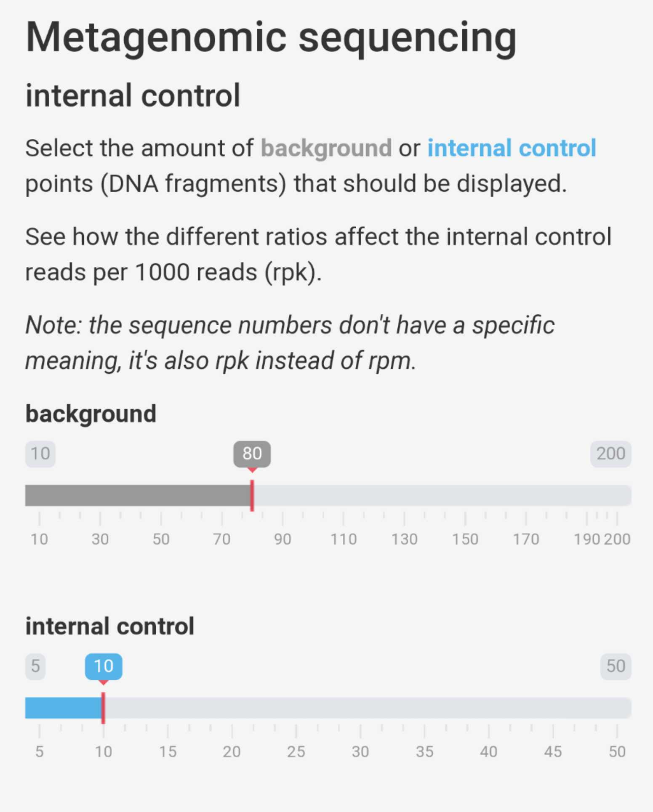
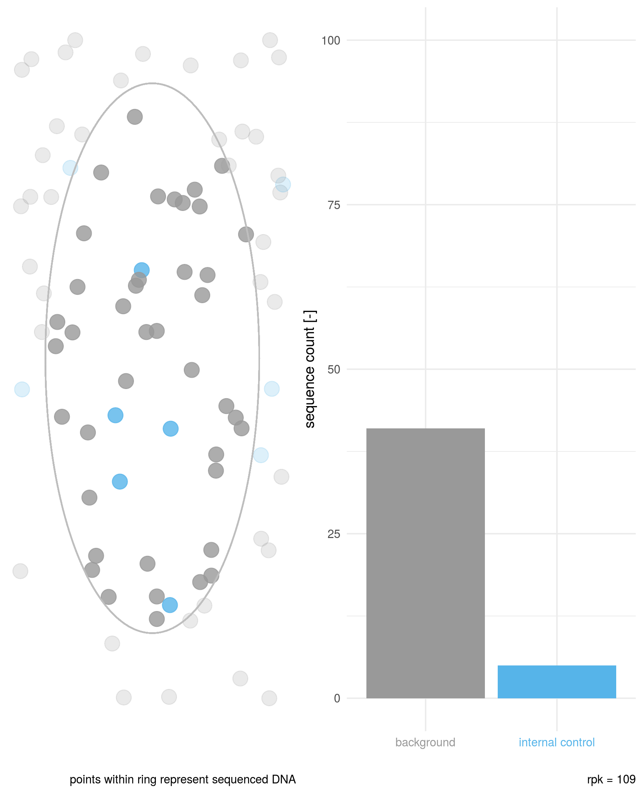

## Metagenomic sequencing
### internal control
Using an internal control (IC) for metagenomic sequencing could lead to a better monitoring of wet lab performance.  
Compared to other methods using internal controls, the amount of internal control detected in metagenomic sequencing is also affected by the amount of total DNA present in the sample (here called background DNA).  
Goal of this app is to show how the sequenced reads of the IC are dependant not only of the amount spiked in but also the amount of background DNA.  
#### How does it work
The amount of background and internal control DNA fragments can be chosen in the sidebar panel.  

Those numbers represent the total points per category in the plot. Of those only a (random) subset are sequenced (points within ring).  
The bar plot shows how many DNA fragments of each category are sequenced.  

